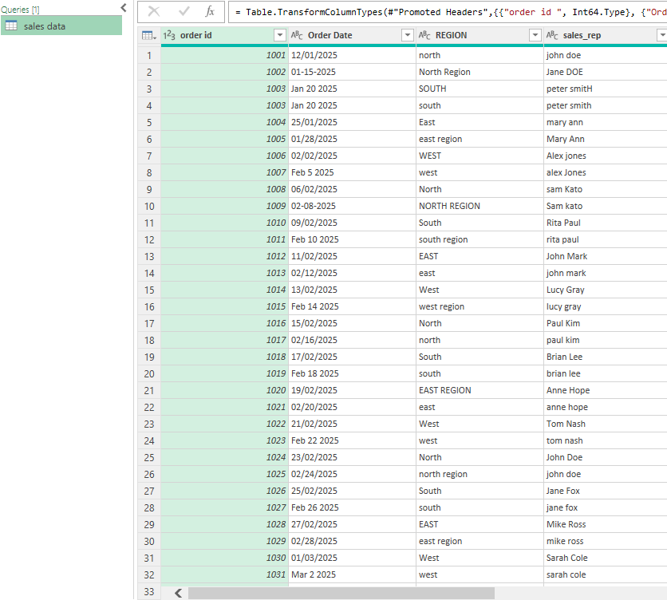
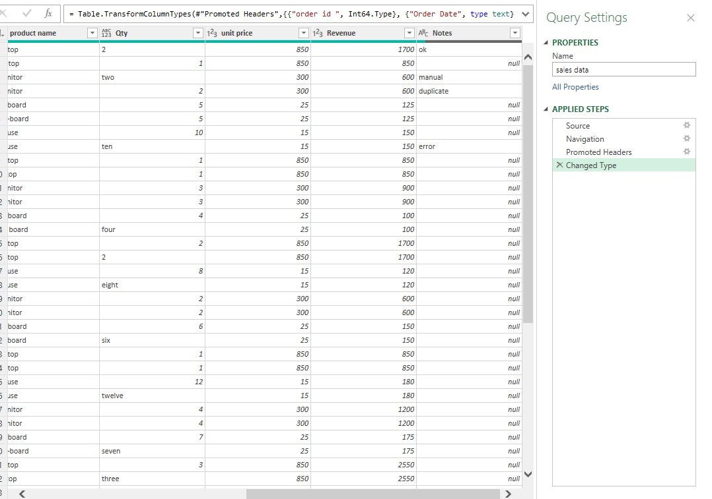
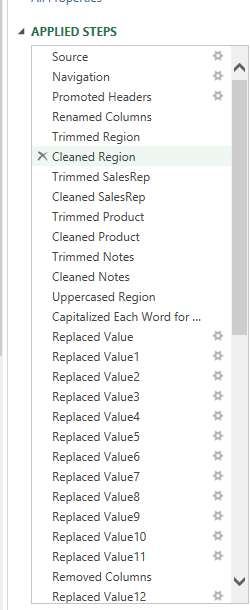
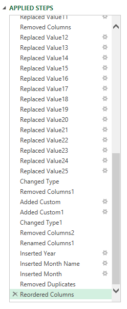
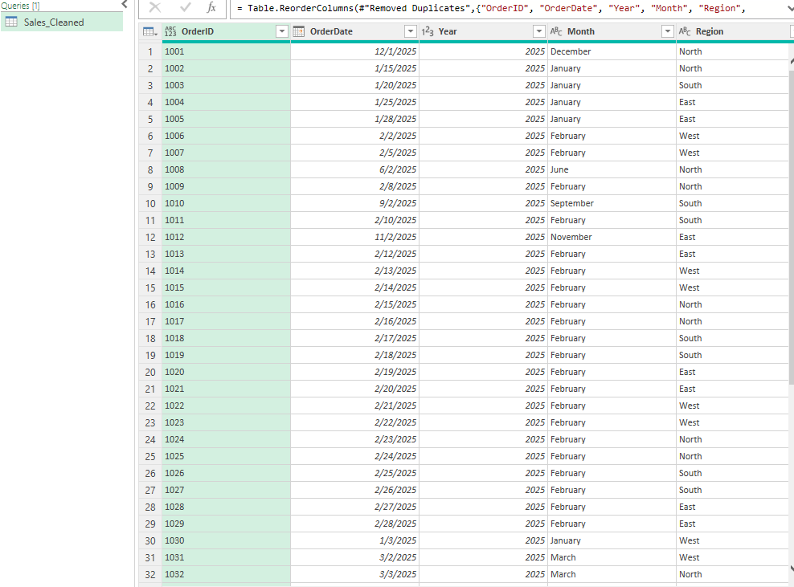
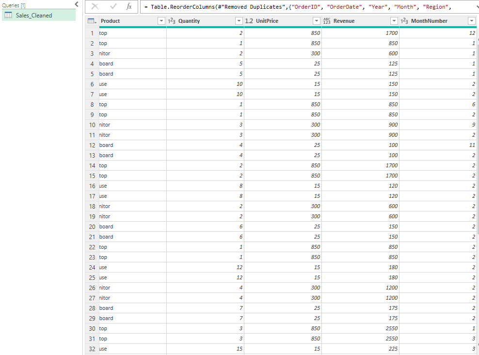

# Power Query Data Cleaning Project
📌 Project Overview
This project demonstrates how to use Excel Power Query to clean, standardize, and prepare messy raw sales data for analysis and reporting.
The raw data intentionally contains common real-world issues such as inconsistent formats, duplicates, text-based numbers, and incorrect calculations.
The goal is to produce a single, clean, refreshable dataset ready for dashboards and further analysis.
________________________________________

🏢 Business Scenario
Sales data is received monthly from multiple branches in inconsistent formats.
Manual cleaning is time-consuming and error-prone.
Management requires:
•	A repeatable cleaning process
•	Standardized data structure
•	One-click refresh capability
________________________________________

🎯 Project Objectives
•	Import raw Excel data using Power Query
•	Clean and standardize all fields
•	Remove errors, duplicates, and unnecessary columns
•	Recalculate key metrics correctly
•	Deliver a final clean fact table
________________________________________

📂 Project Structure
excel-project-66-power-query-data-cleaning/
│
├── data/
│   └── raw_sales_data.xlsx        # Original messy source data
│
├── excel/
│   └── power-query-data-cleaning.xlsx  # Final Excel file with Power Query
│
├── screenshots/
│   ├── raw-data-preview.png       # BEFORE cleaning
│   ├── power-query-steps.png      # Applied Steps view
│   └── cleaned-table-preview.png  # AFTER cleaning
│
└── README.md
________________________________________

🧾 Raw Data Issues Identified
•	Inconsistent column naming
•	Mixed date formats
•	Duplicate records
•	Numbers stored as text
•	Inconsistent region and product names
•	Incorrect revenue values
•	Free-text columns not needed for analysis
📷 Raw Data Preview

________________________________________

🔧 Power Query Cleaning Process
All transformations were performed exclusively in Power Query.
Key steps include:
1.	Import raw Excel file
2.	Promote and standardize headers
3.	Trim and clean text fields
4.	Standardize region and product names
5.	Convert data types correctly
6.	Remove duplicates
7.	Remove unnecessary columns
8.	Create calculated columns (Revenue, Month, Year)
9.	Load cleaned data as a table
📷 Power Query Applied Steps

________________________________________

✅ Final Cleaned Dataset
The final output is a single clean table ready for analysis.
Final Columns:
•	OrderID
•	OrderDate
•	Region
•	SalesRep
•	Product
•	Quantity
•	UnitPrice
•	Revenue
•	Month
•	Year
📷 Cleaned Data Preview

________________________________________

🔄 Refresh Instructions
1.	Replace the raw data file with a new version (same structure)
2.	Open the Excel file
3.	Click Data → Refresh All
4.	Cleaned data updates automatically
________________________________________

🛠 Tools Used
•	Microsoft Excel
•	Power Query (Get & Transform)
________________________________________

📈 Skills Demonstrated
•	Data cleaning and transformation (ETL)
•	Power Query best practices
•	Data standardization
•	Error handling
•	Analytical thinking
•	Documentation for reproducibility
________________________________________

🚀 Next Steps
This cleaned dataset can be reused for:
•	Sales dashboards
•	Power Pivot models
•	Automated reporting solutions
________________________________________

✔️ Notes
•	Raw data remains untouched
•	All logic is transparent and refreshable
•	No formulas or VBA used
________________________________________

